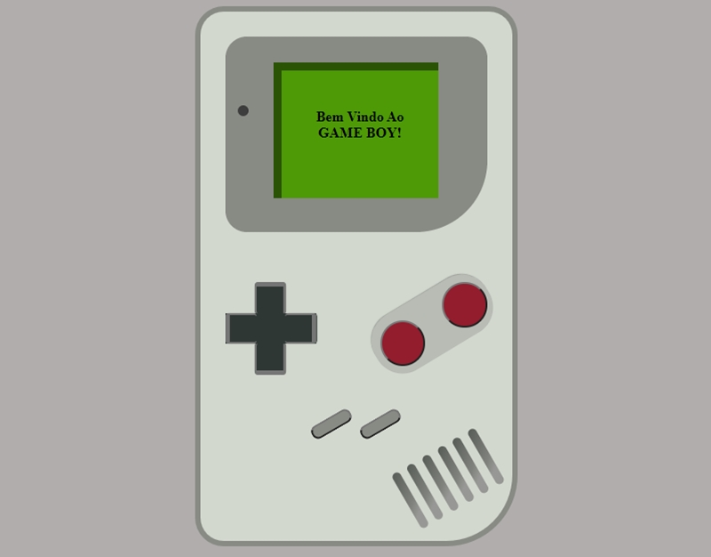

# Rebuild - Criador de HTML
# Desenvolvedor: Igor Fernandes

<pre>
- A biblioteca permite que voce crie códigos HMTL de forma dinâmica, trazendo mais facilidade na implementação de códigos. 
</pre>

- O link do video de demonstracação:

  
<strong>- INSTALAÇÃO:</strong> 

##DIRETO NO HTML: 
<pre>Chama o arquivo reboost dentro do seu código HTML, com o "type" definido como modulo:   </pre>  

<pre>
Em seguida instâncie uma váriável como um tipo "Construct".
</pre> 

<pre>Por fim acesse o método "create" e passe um objeto com os parâmetros para construir seus elementos html.</pre>
 

<pre>

let crt = new Construct();

crt.create({
   type: "div",
   class: "hello-world",
   coord: document.querySelector("body"),
   child:[
      Olá Mundo        
   ]
});
</pre>

   
 
<pre>4° - Agora coloque a classe 'sidebar' dentro da mesma div em que está o 'data-offset'</pre>    

<pre>6° - Coloque também a classe 'content' na div irmã da que está com a class 'sidebar'</pre>   

<pre>5° - Ainda nos seus códigos, coloque o atributo 'data-sideBtn' no seu button responsável pela ativação do sidebar</pre>   

<strong><h3>PRONTO!</h3></strong> 

Agora o código irá configurar sozinho a propriedade do sidebar, além de criar um botão personalizado. 

   

<strong><h3>#DOCUMENTAÇÃO:</h3></strong> 

<strong>data-offset</strong> - Nesse atributo podemos modificar sua estrutura. O valor 'default' é  representado pelo sidebar alcançando 15% da tela, mas caso queira ajustar para outras propriedades, os valores disponívels são:

<table>
  <tbody>
    <tr>
      <td>data-offset</td><td>default</td>
    </tr>
    <tr>
       <td>data-offset</td><td>25</td>
    </tr>
    <tr>
       <td>data-offset</td><td>50</td>
    </tr>
    <tr>
       <td>data-offset</td><td>75</td>
    </tr>
    <tr>
       <td>data-offset</td><td>90</td>
    </tr>
    <tr>
       <td>data-offset</td><td>100</td>
    </tr>
  </tbody>
</table>

   

<strong>data-sideBtn</strong> - Esse atributo foi configurado para aceitar dois valores:   

<strong>data-sideBtn="pillars"</strong> - Irá criar pilares no botão, com o efeito único. Caso queira modificar o elemento de dentro, voce pode utilizar qualquer símbolo disponível nesse site: https://pt.wiktionary.org/wiki/%E2%98%B0. Apenas chame no final do seu código a função btnSideBar() e coloque o símbolo dentro dela. Exemplo:  

<pre>

</pre>
   

<strong>data-sideBtn="cross"</strong> - Irá criar também três pilares deitados, mas a animação final irá transformar os itens em um "X"; Não há como variar, apenas manter esse efeito.
   

<strong>data-sideBtn</strong> - Caso queira criar voce mesmo o seu botão, apenas coloque a propriedade sem um valor para que não seja criado um elemento. 

   

<Strong>RESPONSIVIDADE:</strong>

Todos as resoluções abaixo de 425px terão como padrão o sidebar 100%. Caso haja necessidade de modificação, modifique por conta própria na folha de estilo. 

